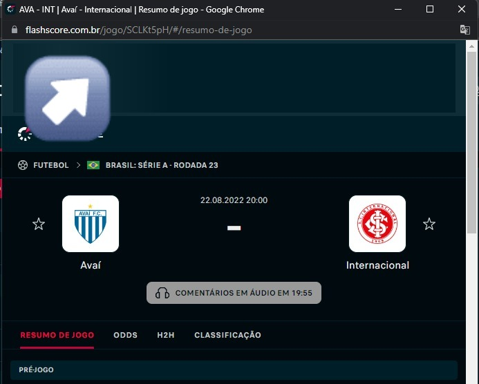

## Como usar:
### Para utilizar essa api, o usuário precisará acessar o site <a href='https://www.flashscore.com.br/'>flashscore</a>, escolher uma partida de futebol, copiar o id da partida e mandar ele via parametro para a API.

## Como rodar a aplicação:

No terminal, clone o projeto:
```
git clone https://github.com/JoseLucasapp/soccer-stats-web-scraping.git && cd soccer-stats-web-scraping
```

### Para inicializar o projeto:

utilizando yarn:
```
yarn && yarn start
```

utilizando npm:
```
npm install && npm start
```

### Para acessar o app:

url: <a href='http://localhost:3000'>http://localhost:3000</a>

## Exemplo de uso:

### Exemplo de código da partida:


### Exemplo utilizando a partida acima:
url: <a href='http://localhost:3000/SCLKt5pH'>http://localhost:3000/SCLKt5pH</a>

### Atenção, o repositório é apenas para estudos. Todos os direitos são do <a href='https://www.flashscore.com.br/'>flashscore</a>.
